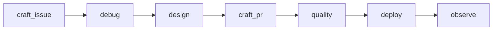

# AI-assisted coding

Personal **strategies for shipping code with Cursor**, agents, and **user-scoped** skills and rules—not hardware setup. For **machine and editor install**, see **[`../setup/macOS.md`](../setup/macOS.md)** (and parity). For **employer SDE2** norms, bookmarks, and team runbook *stubs*, see **[`../setup/work.md`](../setup/work.md)**. For **personal life tasks** (P0–P4, governance), see **[`../plan/README.md`](../plan/README.md)**.

**Upstream:** [Notes root](../README.md)

## Purpose

- Keep **one topic per file** so you can link a ticket or chat to a single runbook.
- Separate **how to frame and execute engineering work with AI** from device shopping notes and from the personal task mirror.

## Delivery spine (folders)

**Sidecar:** [`templates/README.md`](templates/README.md) — pasteables (doc/wiki/gh/git); artifact toolbox used across phases, not a separate “step” in the spine.

## Summary

| You need… | Start here |
| --- | --- |
| **Idea → ticket → Plan mode → work** (common resolution path) | [`debug/README.md`](debug/README.md); index stub [`debug/task-resolution-lifecycle.md`](debug/task-resolution-lifecycle.md) |
| **Solution shape** (contracts, architecture scaffolds) | [`design/README.md`](design/README.md) |
| **Lifecycle map** linking this folder to `cursor-skills` | [`deploy/lifecycle-skills-map.md`](deploy/lifecycle-skills-map.md); legacy path [`deploy/shipping-and-skills-hub.md`](deploy/shipping-and-skills-hub.md) |
| **Publish, post-merge** | [`deploy/README.md`](deploy/README.md) |
| **Calm review** before PR (read code + tests, under research) | [`quality/README.md`](quality/README.md), [`quality/review-calm-read.md`](quality/review-calm-read.md) |
| **Post-deploy / prod** tracing (DevTools, cloud read-only, dashboards) | [`observe/README.md`](observe/README.md), [`observe/prod-ui-flows.md`](observe/prod-ui-flows.md) |
| What to set up **per repo** (`.cursor/`, terminal pin, rules) | [`craft-issue/maintenance/repo-bootstrap.md`](craft-issue/maintenance/repo-bootstrap.md) |
| How to **write** an issue or ticket agents can run | [`craft-issue/creativity/create-engineering-task.md`](craft-issue/creativity/create-engineering-task.md) |
| How to **triage / dedupe / reshape** issues before implementation | [`craft-issue/maintenance/issue-triage-and-reshape.md`](craft-issue/maintenance/issue-triage-and-reshape.md) |
| How to **execute** a task (modes, terminal vs agent, verify) | [`craft-pr/work-task-with-agents.md`](craft-pr/work-task-with-agents.md) |
| **Model** choice, value tier (re-check pricing), when to escalate | [`craft-issue/creativity/models-and-modes.md`](craft-issue/creativity/models-and-modes.md) |
| **Default: Plan first** (summarize + plan; pad chat; Agent after) | [`craft-issue/creativity/plan-first-and-ui-context.md`](craft-issue/creativity/plan-first-and-ui-context.md) |
| **`@` skills**, browser capture, chat patterns | [`craft-pr/skills-and-chat-patterns.md`](craft-pr/skills-and-chat-patterns.md) |

## Index

- [Purpose](#purpose)
- [Delivery spine](#delivery-spine-folders)
- [Summary](#summary)
- [Index](#index)
- [How this folder relates to `setup/work`](#how-this-folder-relates-to-setupwork)
- [Topic files](#topic-files)

---

## Topic files

| File | Role |
| --- | --- |
| [`debug/README.md`](debug/README.md) | **Task readiness**: phased idea → plan → work (not prod tracing). |
| [`debug/signals-and-stops.md`](debug/signals-and-stops.md) | When to stop executing and return to Plan or ticket. |
| [`debug/task-resolution-lifecycle.md`](debug/task-resolution-lifecycle.md) | Stub linking into `debug/` phase pages. |
| [`design/README.md`](design/README.md) | **Design lane**: pointers into `templates/` for contracts and architecture. |
| [`quality/README.md`](quality/README.md) | **Quality lane**: pre-merge confidence (calm read today). |
| [`quality/review-calm-read.md`](quality/review-calm-read.md) | Review modus operandi: stop, read code and test results calmly (draft). |
| [`deploy/README.md`](deploy/README.md) | **Shipping**: lifecycle/skills map, quick pattern, post-merge stub. |
| [`deploy/lifecycle-skills-map.md`](deploy/lifecycle-skills-map.md) | Phases → notes + cursor-skills references. |
| [`deploy/quick-shipping-pattern.md`](deploy/quick-shipping-pattern.md) | Five-step shipping pattern. |
| [`deploy/post-merge-checklist.md`](deploy/post-merge-checklist.md) | After merge: verify in prod (stub). |
| [`deploy/shipping-and-skills-hub.md`](deploy/shipping-and-skills-hub.md) | Legacy pointer into `deploy/`. |
| [`observe/README.md`](observe/README.md) | **Production signals** hub. |
| [`observe/prod-ui-flows.md`](observe/prod-ui-flows.md) | DevTools, cloud read-only, dashboards. |
| [`craft-issue/maintenance/repo-bootstrap.md`](craft-issue/maintenance/repo-bootstrap.md) | Per-repo `.cursor/` checklist and pinned terminal; optional `.cursor/templates/` pasteables per repo or from `cursor-skills`. |
| [`craft-issue/creativity/create-engineering-task.md`](craft-issue/creativity/create-engineering-task.md) | Ticket skeleton and agent-friendly fields. |
| [`craft-issue/maintenance/issue-triage-and-reshape.md`](craft-issue/maintenance/issue-triage-and-reshape.md) | Read-only triage flow and issue reshape checklist before opening or editing issues. |
| [`craft-pr/work-task-with-agents.md`](craft-pr/work-task-with-agents.md) | Agent vs terminal, chunking, verify. |
| [`craft-issue/creativity/models-and-modes.md`](craft-issue/creativity/models-and-modes.md) | Model policy; routine **best value** tier (e.g. Composer 2 non-Fast—re-validate when pricing changes). |
| [`craft-issue/creativity/plan-first-and-ui-context.md`](craft-issue/creativity/plan-first-and-ui-context.md) | Default bias: Plan before Agent; use chat context (no extra “skill” for built-in UI). |
| [`craft-pr/skills-and-chat-patterns.md`](craft-pr/skills-and-chat-patterns.md) | `@` skills and capture patterns. |

---

## How this folder relates to `setup/work`

[`setup/work.md`](../setup/work.md) holds **your** SDE2-oriented **personal work document** outline: deploy runbook, **debug** stub, **on-call** stub, verify deployed results, test locally. Put **team-specific URLs, service names, and escalation paths** there.

This **`code/`** tree adds **Cursor- and agent-specific** playbooks (skills, models, DevTools flow) that apply across repos. When a procedure needs both, link from the ticket: e.g. “Observe: follow `code/observe/prod-ui-flows.md`; paste dashboard links from `setup/work.md`.”
