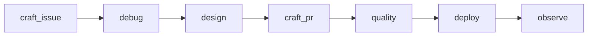

# 💻 AI-assisted coding

**Cursor**, agents, and **user-scoped** skills for shipping code—runbooks in the folders below. Team URLs and machine install live under [`../configure/`](../configure/README.md), not here.

## 📑 Index

| Folder | README |
| --- | --- |
| **Craft issue** | [`craft-issue/README.md`](craft-issue/README.md) — tickets, Plan mode, models, repo bootstrap. |
| **Debug** | [`debug/README.md`](debug/README.md) — idea → plan → work readiness. |
| **Design** | [`design/README.md`](design/README.md) — solution shape before heavy implementation. |
| **Craft PR** | [`craft-pr/README.md`](craft-pr/README.md) — execution with agents and skills. |
| **Quality** | [`quality/README.md`](quality/README.md) — pre-merge calm read and evidence. |
| **Deploy** | [`deploy/README.md`](deploy/README.md) — publish and post-merge. |
| **Observe** | [`observe/README.md`](observe/README.md) — production signals after deploy. |
| **Templates** | [`templates/README.md`](templates/README.md) — pasteables (doc, diagrams, gh, git, pr, …). |

## 🧭 From here

| You need… | Start here |
| --- | --- |
| **Idea → ticket → Plan → work** | [`debug/README.md`](debug/README.md) |
| **Execute with agents** | [`craft-pr/work-task-with-agents.md`](craft-pr/work-task-with-agents.md) |
| **Per-repo `.cursor/` setup** | [`craft-issue/maintenance/repo-bootstrap.md`](craft-issue/maintenance/repo-bootstrap.md) |
| **Pasteable doc / gh / git** | [`templates/README.md`](templates/README.md) |
| **Team dashboards / on-call URLs** | [`../configure/work.md`](../configure/work.md) (paste into tickets; generic flow stays in **observe/**) |

**Parent:** [Notes root](../README.md)
