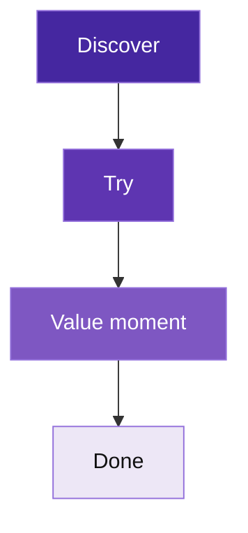
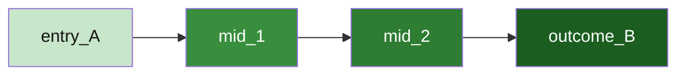
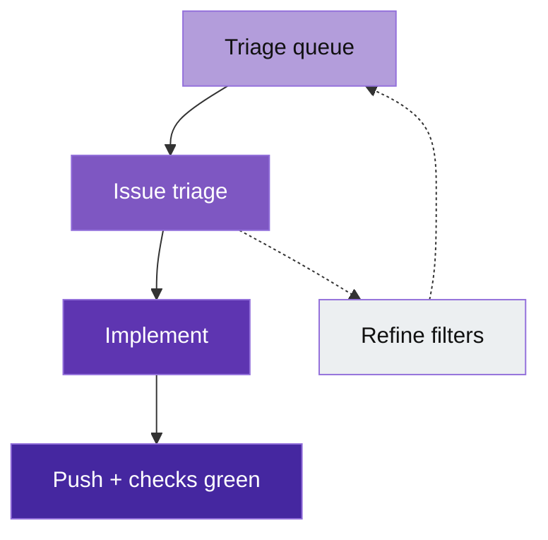

# Diagram examples (Mermaid only)

**Portable copy:** Paste only the fenced **`mermaid`** blocks elsewhere; drop links if the path breaks.

Small **reference figures**—copy a block into your **`docs/`** page. **No** separate render step; preview in Cursor or GitHub. Ramps: [`palette.md`](palette.md). Conventions: [`../doc/diagram-conventions.md`](../doc/diagram-conventions.md).

## UX ramp (`ux*` family — product / usability, **entry-strong**)

Hero on the **first** step; lighter toward **Done** (use **UX leaf-strong** below when the outcome should win).



## Spine with RGB ramp (three nodes)

```mermaid
flowchart LR
  classDef spineA fill:rgb(27,94,32),color:#fff
  classDef spineMid fill:rgb(56,142,60),color:#fff
  classDef spineB fill:rgb(200,230,201),color:#111
  nodeA[Branch created] --> nodeMid[Push + CI] --> nodeB[Review green]
  class nodeA spineA
  class nodeMid spineMid
  class nodeB spineB
```

## Green ramp (hex fills, **leaf-strong**)



## UX leaf-strong (workflow style)

Strong on **merge / publish** outcome; lighter upstream on the same **`ux*`** ramp; optional side path muted.


