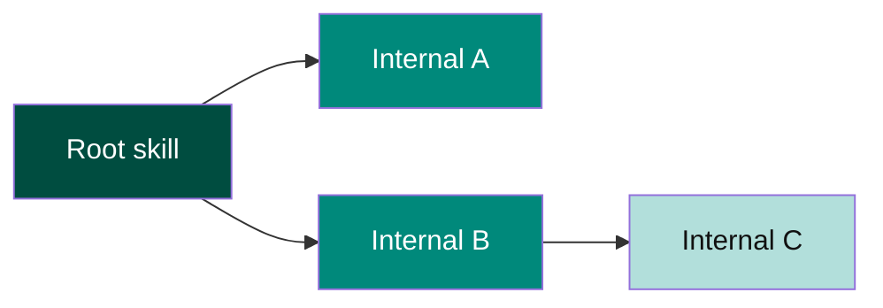

# Template: DAG / fan-out (left-right)

**Portable copy:** When pasting only the **`mermaid`** block, remove this header and links. Ramps: [`palette.md`](palette.md). Rules: [`../doc/diagram-conventions.md`](../doc/diagram-conventions.md).

Copy the **fenced `mermaid` block**. Use for delegation graphs with a root and branches.

