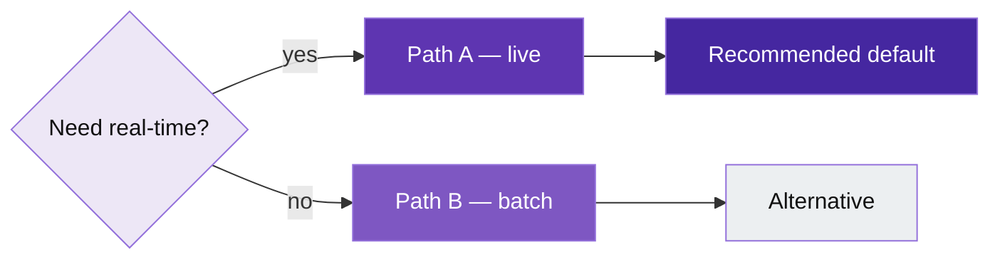

# Template: decision / when to use (UX or policy)

**Portable copy:** When pasting only the **`mermaid`** block, remove this header and links. Colors: [`palette.md`](palette.md) (`ux*` or `op*`). Rules: [`../doc/diagram-conventions.md`](../doc/diagram-conventions.md).

Copy the **fenced `mermaid` block**. Mark the **recommended** path with the **strongest** fill (`uxH` or `opH`).

