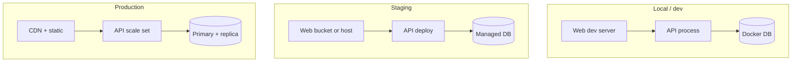
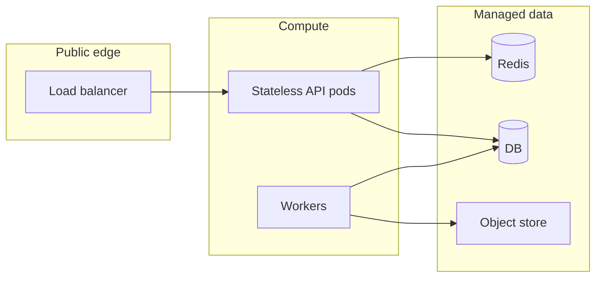

# Deployment topology (environments + split services)

Sketch **where** each piece runs: local, staging, production. Useful for **full stack** onboarding and **study** (compare PaaS vs k8s vs serverless). Keep boxes coarse—this is not a replacement for IaC.

## Multi-environment

## Single environment — logical zones

## Related

- Operations deployment prose: [`../doc/wiki/profiles/coding/operations-deployment.md`](../doc/wiki/profiles/coding/operations-deployment.md)
- Layered app vs services: [`template-layers.md`](template-layers.md)
