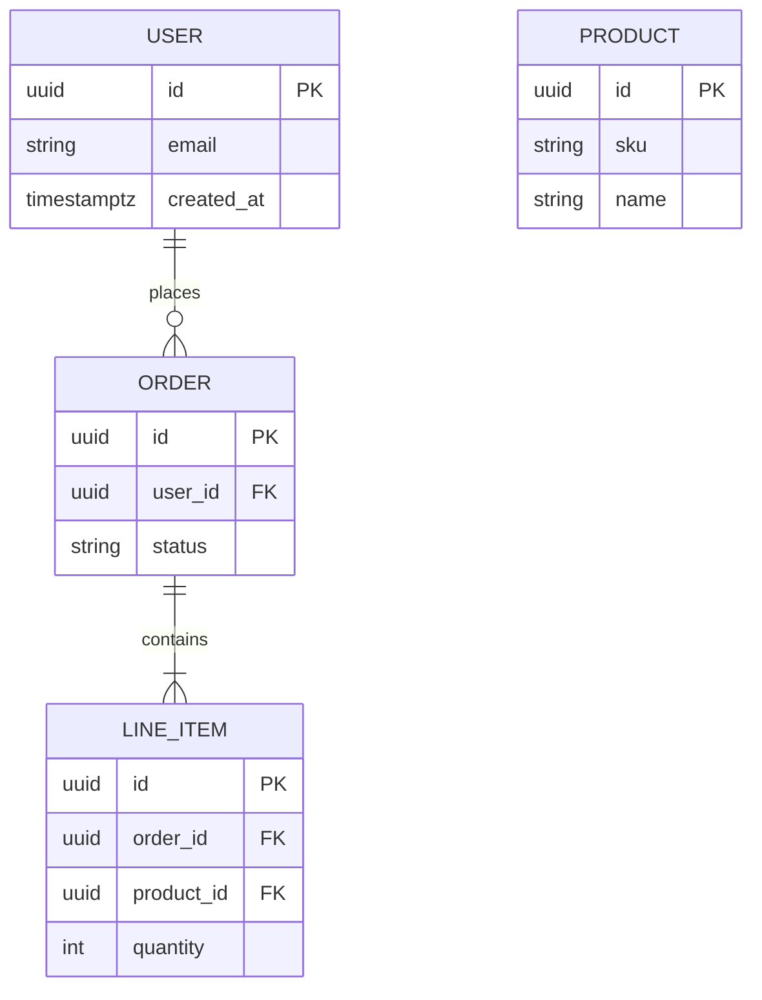

# Entity–relationship (study / schema draft)

Use **`erDiagram`** for courses, design reviews, or **draft** persistence before migrations exist. Replace entities and cardinalities with your domain.

## Scaffold

## Notes

- Keep names aligned with **actual** tables or postpone sync until the schema is implemented.
- For **read models** vs **write models** (CQRS), either duplicate entities with suffixes or add a second small `erDiagram` block.

## Related

- Data modeling prose: [`../doc/wiki/profiles/coding/data-models.md`](../doc/wiki/profiles/coding/data-models.md)
- Palette (colors in other diagram types): [`palette.md`](palette.md)
