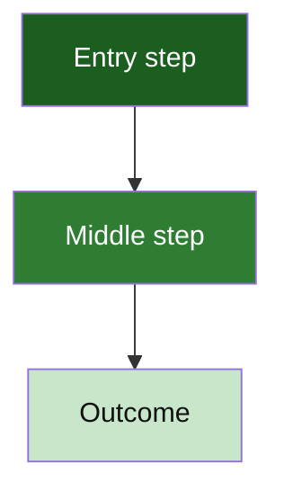

# Template: flowchart (top-down pipeline)

**Portable copy:** When pasting only the **`mermaid`** block, remove this header and links. Ramps: [`palette.md`](palette.md) (`hueGh*`). Rules: [`../doc/diagram-conventions.md`](../doc/diagram-conventions.md).

Copy the **fenced `mermaid` block below** into a **`docs/`** page or PR body. Replace node labels; keep **`classDef`** and **`class`** in the **same** block.

