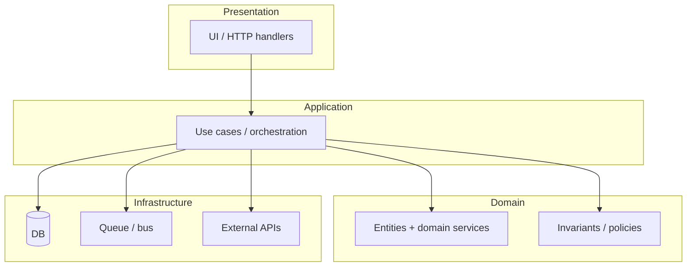
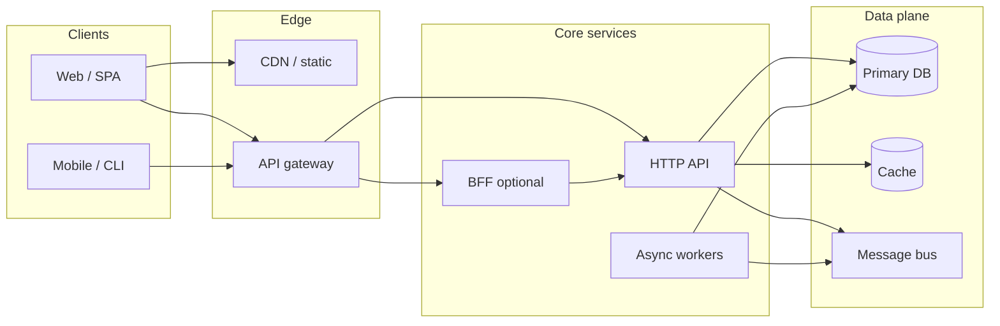

# Layered / split architecture (full stack)

Shows **presentation → application → domain → infrastructure** (or a **split deployable** view: web app, API, workers). Adjust subgraph labels to match your repo (`apps/web`, `services/api`, etc.).

## Horizontal layers (single deployable)

## Split packages / services (same diagram style)

## Related

- System overview table + simple flow: [`../doc/wiki/profiles/coding/architecture-system-overview.md`](../doc/wiki/profiles/coding/architecture-system-overview.md)
- Repo layout ideas: [`../fullstack/repo-layout-domain-split.md`](../fullstack/repo-layout-domain-split.md)
