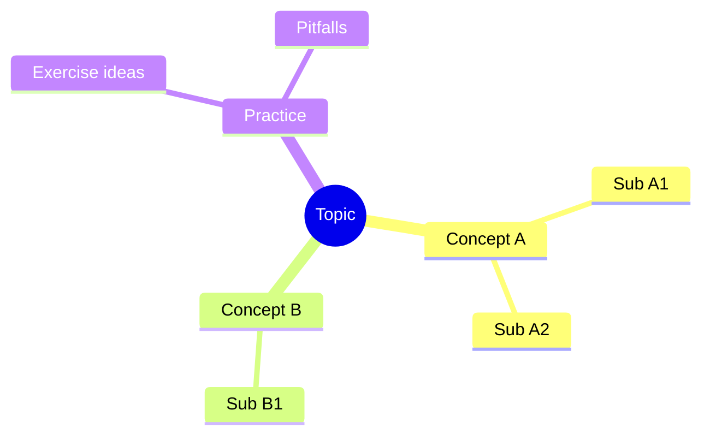

# Mind map (study notes)

Use **`mindmap`** for **courses**, **cert prep**, or **exploring** a topic before you collapse it into a linear doc. Mermaid support depends on renderer (GitHub, static site generator, Cursor preview)—if it fails, fall back to a nested bullet list in the same file.

## Scaffold

## When not to use

- **Normative architecture** for a production system → prefer [`template-layers.md`](template-layers.md), [`template-flowchart.md`](template-flowchart.md), or [`template-decision.md`](template-decision.md).
- **Schema** → [`template-er.md`](template-er.md).

## Related

- Explanation page skeleton: [`../doc/explanation.md`](../doc/explanation.md)
- Study sheet (prose + diagram slots): [`../fullstack/study-topic-sheet.md`](../fullstack/study-topic-sheet.md)
