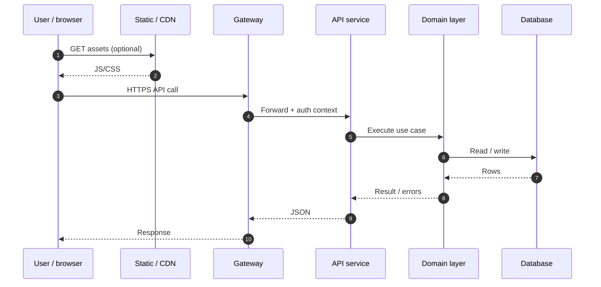
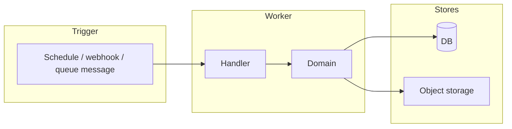

# End-to-end request path (full stack trace)

One **happy-path** user action traced through **split** components: browser → edge → API → domain → persistence. Good for onboarding, incident runbooks, and **study** walkthroughs.

## Sequence (typical web app)

## Flowchart variant (batch / async)

## Related

- Generic sequence: [`template-sequence.md`](template-sequence.md)
- Layers overview: [`template-layers.md`](template-layers.md)
