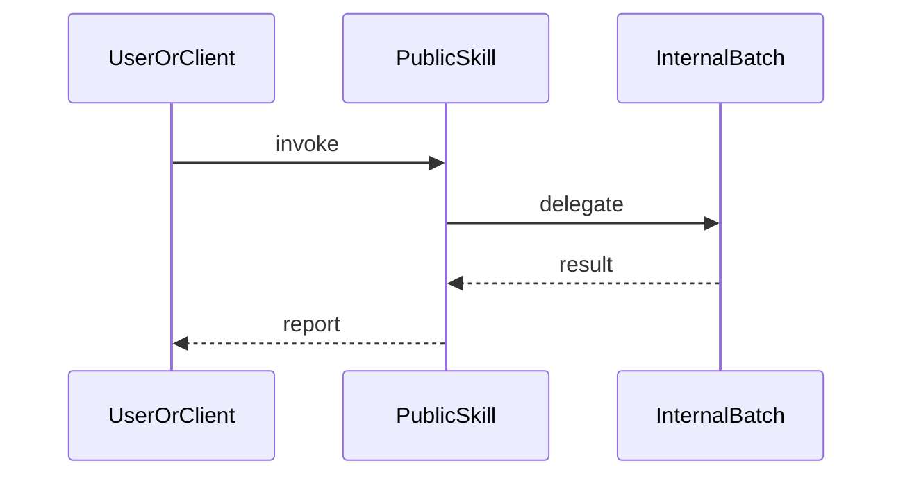

# Template: sequence diagram

**Portable copy:** When pasting only the **`mermaid`** block, remove this header and links. (`sequenceDiagram` uses participant styling—not `classDef` in all renderers.) Rules: [`../doc/diagram-conventions.md`](../doc/diagram-conventions.md).

Copy the **fenced `mermaid` block** into your doc. Rename participants and messages.

