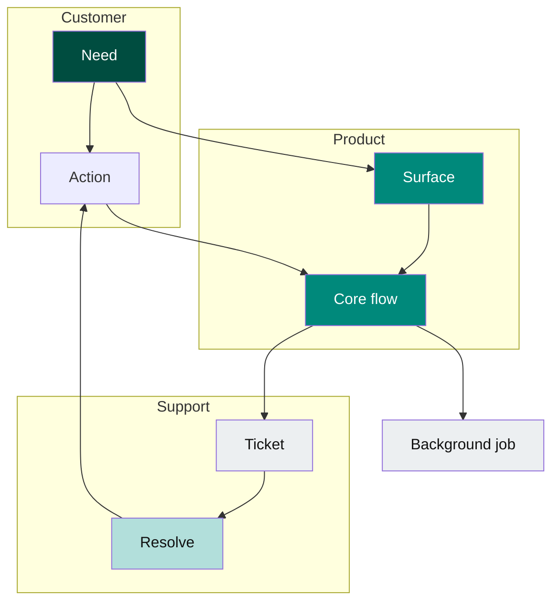

# Template: stakeholder / lane flow (service view)

**Portable copy:** When pasting only the **`mermaid`** block, remove this header and links. Colors: [`palette.md`](palette.md) (`op*` spine, `uxOff` / `opOff` for side lanes). Rules: [`../doc/diagram-conventions.md`](../doc/diagram-conventions.md).

Copy the **fenced `mermaid` block**. Keep **one primary story** across subgraphs; **muted** classes for background systems.

