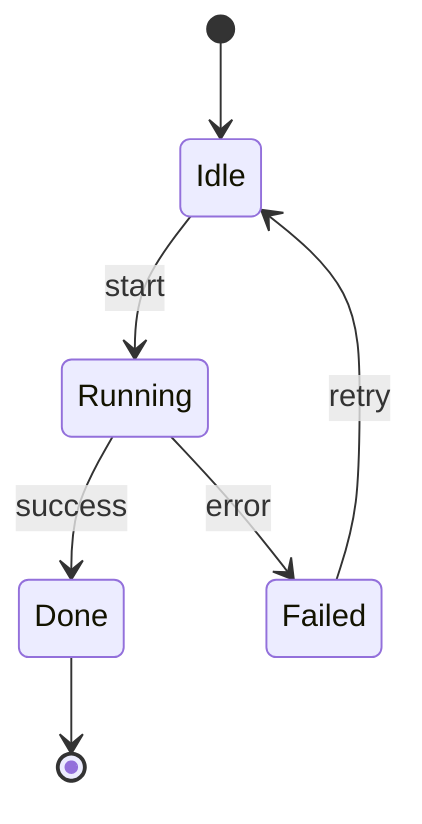

# Template: state diagram

**Portable copy:** When pasting only the **`mermaid`** block, remove this header and links. Rules: [`../doc/diagram-conventions.md`](../doc/diagram-conventions.md).

Copy the **fenced `mermaid` block**. Adjust states and transitions.

