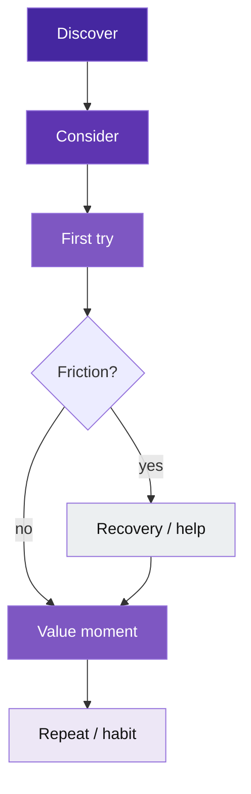

# Template: user journey (usability / product)

**Portable copy:** When pasting only the **`mermaid`** block, remove this header and links. Colors: [`palette.md`](palette.md) (`ux*` family). Rules: [`../doc/diagram-conventions.md`](../doc/diagram-conventions.md).

Copy the **fenced `mermaid` block** into your doc. Put the **hero** (`uxH`) on the step that must grab attention (first success, pain point, or “aha”).

