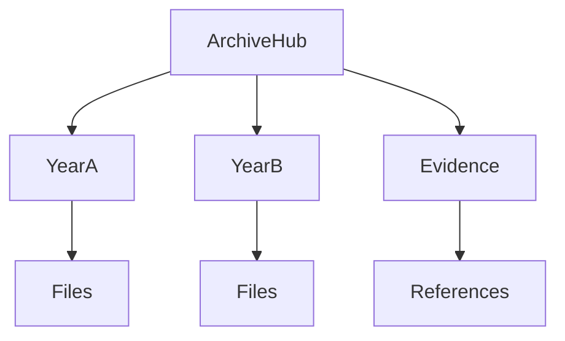

# <Archive Folder> README

## 📇 Index

1. [🗺️ Diagram](#-diagram)
2. [🧭 When to open this archive](#-when-to-open-this-archive)
3. [📚 Contents summary](#-contents-summary)
4. [📌 Maintenance rules](#-maintenance-rules)
5. [🔗 Related](#-related)

## 🗺️ Diagram

## 🧭 When to open this archive

- Open this folder when you need official evidence or historical records.
- Open child folders by year, entity, or type—not by random browsing.

## 📚 Contents summary

| Child entry | Type | Typical use |
| --- | --- | --- |
| `<2024/>` | Year bucket | Find records for that year |
| `<2025/>` | Year bucket | Find records for that year |
| `<entity/>` | Entity bucket | Legal or financial tracing |

## 📌 Maintenance rules

1. Keep file names factual and stable.
2. Add new records to the correct child bucket first.
3. Update this README summary when a new bucket is created.
4. Never move sensitive files without updating links.

## 🔗 Related

- Parent archive hub: `<../README.md>`
- Regional hub: `<../../README.md>`
