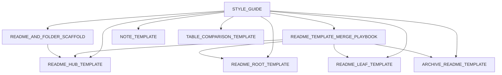

# Markdown templates

## 📇 Index

1. [`STYLE_GUIDE.md`](STYLE_GUIDE.md)
2. [`README_AND_FOLDER_SCAFFOLD.md`](README_AND_FOLDER_SCAFFOLD.md)
3. [`README_TEMPLATE_MERGE_PLAYBOOK.md`](README_TEMPLATE_MERGE_PLAYBOOK.md)
4. [`README_ROOT_TEMPLATE.md`](README_ROOT_TEMPLATE.md)
5. [`README_HUB_TEMPLATE.md`](README_HUB_TEMPLATE.md)
6. [`README_LEAF_TEMPLATE.md`](README_LEAF_TEMPLATE.md)
7. [`NOTE_TEMPLATE.md`](NOTE_TEMPLATE.md)
8. [`ARCHIVE_README_TEMPLATE.md`](ARCHIVE_README_TEMPLATE.md)
9. [`TABLE_COMPARISON_TEMPLATE.md`](TABLE_COMPARISON_TEMPLATE.md)

## 🗺️ Diagram

## 🧭 Template selection

| If you are writing… | Use |
| --- | --- |
| Repository root `README.md` | [`README_ROOT_TEMPLATE.md`](README_ROOT_TEMPLATE.md) |
| Folder hub `README.md` (non-root) | [`README_HUB_TEMPLATE.md`](README_HUB_TEMPLATE.md) |
| Deep leaf/index `README.md` in a small folder | [`README_LEAF_TEMPLATE.md`](README_LEAF_TEMPLATE.md) |
| Non-README operational/reference page (`*.md`) | [`NOTE_TEMPLATE.md`](NOTE_TEMPLATE.md) + [`STYLE_GUIDE.md`](STYLE_GUIDE.md) |
| Archive hub README with year/entity buckets | [`ARCHIVE_README_TEMPLATE.md`](ARCHIVE_README_TEMPLATE.md) |
| New subtree: folder layout + README order | [`README_AND_FOLDER_SCAFFOLD.md`](README_AND_FOLDER_SCAFFOLD.md) |
| Re-apply a template without wiping live tables or bullets | [`README_TEMPLATE_MERGE_PLAYBOOK.md`](README_TEMPLATE_MERGE_PLAYBOOK.md) |
| Many similar items, comparison matrices, status grids | [`TABLE_COMPARISON_TEMPLATE.md`](TABLE_COMPARISON_TEMPLATE.md) |

## 📌 Purpose

- Generic markdown scaffolds for **any** repository (public or private).
- Before **creating** a subtree, open [`README_AND_FOLDER_SCAFFOLD.md`](README_AND_FOLDER_SCAFFOLD.md); before **normalizing** an existing `README.md`, open [`README_TEMPLATE_MERGE_PLAYBOOK.md`](README_TEMPLATE_MERGE_PLAYBOOK.md).

## 🔗 Related

- All template areas and copy instructions: [`../../README.md`](../../README.md) (this pack’s **`templates/README.md`**).
