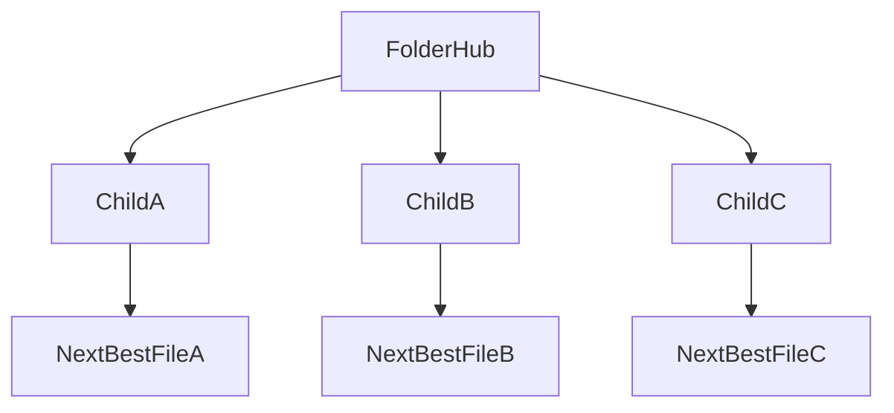

# <Folder Name> hub

Use this template for **generic non-root folder hubs** (for example: `docs/`, `src/`, `packages/`).

If this is the repository root README, use [`README_ROOT_TEMPLATE.md`](README_ROOT_TEMPLATE.md) instead.

## 📇 Index

1. [🧾 Folder summary](#-folder-summary)
2. [🧭 Where to open what](#-where-to-open-what)
3. [🗺️ Diagram](#-diagram)
4. [📚 Folder map](#-folder-map)
5. [🔗 Related](#-related)

## 🧾 Folder summary

- 3–6 bullets with the most relevant content in this subtree.
- Keep this section curated and concise (not exhaustive).
- Use it as a “best of” filter, while the index remains complete.

## 🗺️ Diagram

## 🧭 Where to open what

| If I need… | Open |
| --- | --- |
| Quick orientation | `<child-folder/README.md>` |
| <Use case A> | `<file-a.md>` |
| <Use case B> | `<file-b.md>` |
| <Use case C> | `<file-c.md>` |

## 📚 Folder map

| Entry | What it contains |
| --- | --- |
| `<child-folder-or-file-1>` | <Short description> |
| `<child-folder-or-file-2>` | <Short description> |
| `<child-folder-or-file-3>` | <Short description> |

## 🔗 Related

- Parent hub: `<../README.md>`
- Sibling hub A: `<../sibling-a/README.md>`
- Sibling hub B: `<../sibling-b/README.md>`
