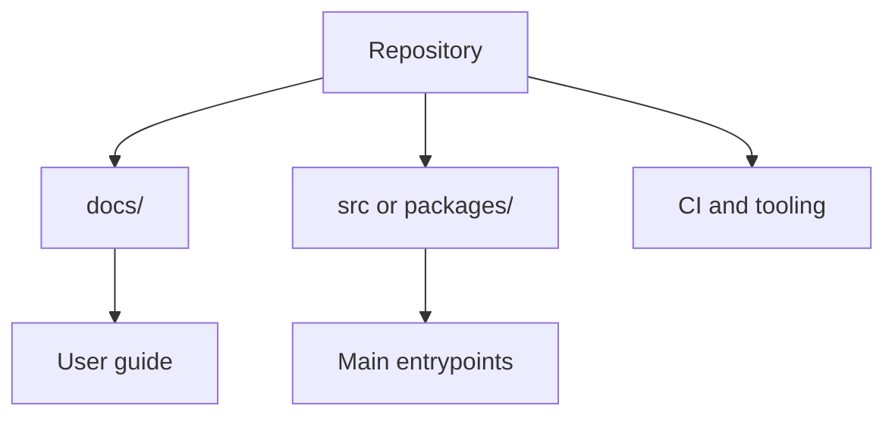

# <Repository Name>

> Use for the **repository root** `README.md` on a typical software project. Adjust sections your team does not need.

## 📇 Index

1. [📍 About](#-about)
2. [🗺️ Diagram](#-diagram)
3. [🚀 Quick start](#-quick-start)
4. [📁 Project layout](#-project-layout)
5. [🤝 Contributing and support](#-contributing-and-support)
6. [🔗 Related](#-related)

## 📍 About

- One short paragraph: **what** this repository is and **who** it is for.
- Optional: security disclosure policy, license summary, or link to internal docs index.

## 🗺️ Diagram



## 🚀 Quick start

**Prerequisites**

- List languages, runtime versions, or tools.

**Install and run**

```bash
# Example only — replace with real commands
git clone <repo-url>
cd <repo-directory>
```

## 📁 Project layout

| Path | Role |
| --- | --- |
| `<docs/>` | Human-facing documentation |
| `<src/>` or `<packages/>` | Primary code |
| `<.cursor/templates/>` | Local copy-paste scaffolds (optional) |

## 🤝 Contributing and support

- Link **`CONTRIBUTING.md`** or summarize PR expectations.
- Link **issues**, **discussions**, or team chat as appropriate.

## 🔗 Related

- Hub template for non-root folders: [`README_HUB_TEMPLATE.md`](README_HUB_TEMPLATE.md)
- Style rules: [`STYLE_GUIDE.md`](STYLE_GUIDE.md)
- Subtree scaffold order: [`README_AND_FOLDER_SCAFFOLD.md`](README_AND_FOLDER_SCAFFOLD.md)
