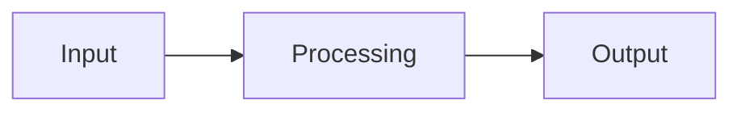

# Data flow

## Typical path

<Describe request/event → processing → output or persistence.>

## Diagram

```mermaid
flowchart LR
  in[Input] --> proc[Processing]
  proc --> out[Output]
```

## Failure and retries

<Where failures surface and how the system recovers.>
