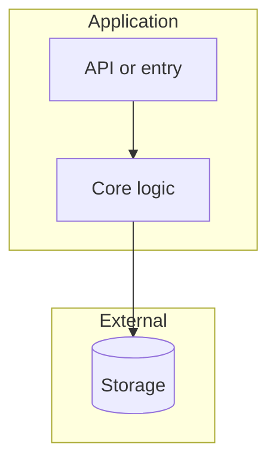

# System overview

## Purpose

<What the system does for users or callers.>

## Major components

| Component | Responsibility |
| --- | --- |
| <name> | <one line> |

## Boundaries

<What is in scope vs delegated to external systems.>

## Diagram

