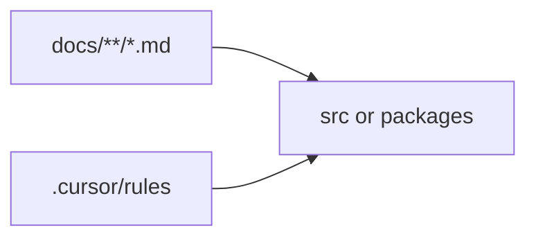

# Docs hub (tooling / meta repository)

**Expanded** scaffold: separate subfolders under **`docs/`**. For **minimal** repos, use a **single** self-contained **`docs/README.md`** instead—see [`manifest.md`](manifest.md).

## Contents

1. [Architecture](architecture-pack-topology.md) — repo topology
2. [Modules](modules-README.md) — top-level domains
3. [Workflows](workflows-README.md) — verify and publish habits
4. [Conventions](conventions-README.md) — authoring rules
5. [Operations](operations-README.md) — install and maintenance
6. [Data](data-README.md) — what is stored where

## Audiences

- **Contributor** — [Conventions](conventions-README.md), [Workflows](workflows-README.md)
- **Operator** — [Operations](operations-README.md)

## Diagram (optional)

