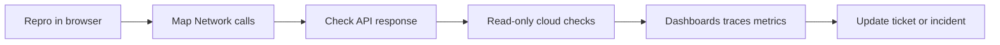

# Debug prod and UI flows (post-deploy / on-call style)

**Upstream:** [`coding/README.md`](README.md)

**Method** for tracing failures across **browser**, **APIs**, and **cloud** without duplicating **team-specific** links. Put **dashboard URLs, service names, log queries, and escalation** in [`../device/work.md`](../device/work.md) (*Debug runbook*, *On-call*, *Verify deployed results*).

## Index

- [Purpose](#purpose)
- [End-to-end flow](#end-to-end-flow)
- [Chrome DevTools: Network](#chrome-devtools-network)
- [Cloud console (read-only)](#cloud-console-read-only)
- [Dashboards](#dashboards)
- [Handoff to incident or ticket](#handoff-to-incident-or-ticket)

---

## Purpose

After a deploy or during an incident, you need a **repeatable** way to decide: **client bug**, **backend bug**, **config**, or **data**. This page is the generic recipe; your **private** runbook holds the bookmarks.

---

## End-to-end flow

1. **Reproduce** with a **minimal** path (one user action if possible).
2. **Identify** the failing **request** and its **status** and **latency**.
3. **Classify**: 4xx vs 5xx, timeout, CORS, stale cache, wrong env.
4. **Correlate** with server logs or traces using IDs from the response or headers.
5. **Record** findings in the ticket; link sanitized HAR or screenshots if policy allows.

---

## Chrome DevTools: Network

| Step | What to do |
| --- | --- |
| **Preserve log** | Turn on **Preserve log** before navigation so redirects do not wipe the table. |
| **Filter** | Filter by **Fetch/XHR** (or relevant type) to reduce noise. |
| **Click the failing row** | Open **Headers**: method, URL, status, request/response headers. |
| **Payload** | For POST/PUT, inspect **JSON** or form body; confirm fields match the UI. |
| **Response** | Read body or error JSON; note **error codes** and **correlation IDs**. |
| **Timing** | See whether the wait is **DNS**, **TLS**, **server**, or **content download**. |

Use this to answer: “Did the front end send the wrong thing?” vs “Did the server answer wrong?”

---

## Cloud console (read-only)

Use **read-only** roles where possible.

| Intent | Typical places (names vary by provider) |
| --- | --- |
| **Is the service up?** | Health checks, target groups, running tasks/pods. |
| **Wrong config?** | Feature flags, env vars, secrets **names** (not values in chat). |
| **Recent deploy?** | Release history, revision timestamps. |
| **Quota / throttle?** | API usage, rate limit metrics. |

Paste **no secrets** into agent chat; describe symptoms and use **redacted** snippets.

---

## Dashboards

Bookmark a **small** set per service: **RPS / errors / latency**, **SLO** or burn, **logs** or **traces** with a deep link template. During an incident, prefer **one** dashboard you know over ten half-familiar ones. Maintain the actual list under [`../device/work.md`](../device/work.md).

---

## Handoff to incident or ticket

When you escalate:

- **What** broke (user-visible).
- **When** (timezone-aware timestamps).
- **Request id** / trace id if present.
- **Hypothesis** and **what you ruled out**.
- **Deploy** or **flag** changes in the window.

That package matches what **you** would want if you were on the receiving end of a page.
