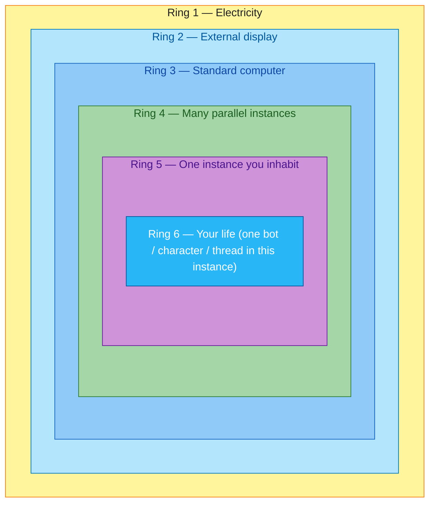
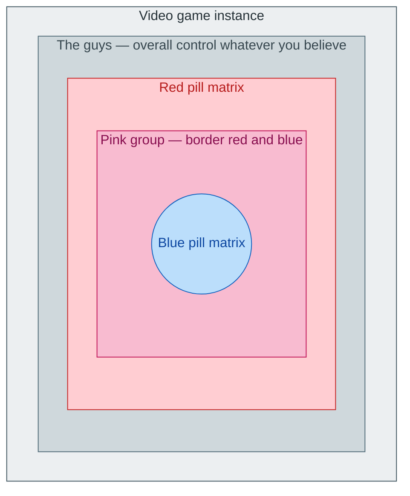
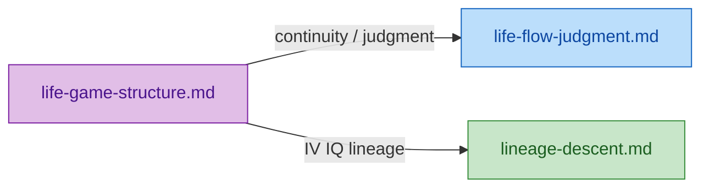

# Life game structure

**Metaphor only** unless you explicitly treat it as a claim: life described as **nested game instances**, **parallel runs on shared hardware** (machine **onion** flowchart below), *Matrix*- and anime-shaped **story rhymes**, a **daily Dark Souls loop**, and an **online** ruleset (League of Legends–style). This doc does **not** add a separate “heaven” layer in the **inner** onion—only **game / control / factions / pill bands**.

**See also:** [Life flow and final judgment](life-flow-judgment.md) (birth–death–judgment, main quest, ledger) · [Lineage descent](lineage-descent.md) (IV/IQ, EV/EQ, branching graph) · [Harm and penalty table](../runbook/foundation.md#harm-and-penalty-time-human-involved-acts)

## Machine onion: computer, power, display, instances, you

Two onions stack conceptually: this section is the **outer** one (**where** the run lives). The [inner onion](#nested-instance-onion-no-heaven) (pills / factions) is **inside** a **single instance**—the layer labeled **one instance you inhabit** below.

Read the flowchart **outside → inside** (each `subgraph` is a ring):

**Ring 1 — Electricity.** **Keep-alive** for the whole stack: no power, no run—maps to “something has to sustain the process.”

**Ring 2 — External display.** **Output** of the machine: **lots of people** can **see** what is on screen (read-only for most). **Few** have **write** access—admins, operators, mythic **Architect** types who can **change rules, state, or forks** of the run (still **metaphor**).

**Ring 3 — Standard computer.** The **host**: one **case** running a **shared game stack** (CPU/GPU/RAM as boring plumbing—everything that makes parallel instances possible without collapsing).

**Ring 4 — Many parallel instances.** **Several game instances** at once—**parallel researches**, other timelines, other societies, other tabs in the same runtime. Same **ruleset build**, different **world slots**.

**Ring 5 — One instance you inhabit.** The **single** instance **you** treat as **the** world: your era, map, and social physics.

**Ring 6 — Your life.** Not the whole instance—**one bot** (or **character**, **agent**, **thread**) **inside** that instance: **you** as a **small automaton** following local inputs, one of **many** such units in the same world slot.

## Default play (blue pill)

You start in a world where **most things feel truthful**. **Someone authored the rules** (parents, history, institutions, physics) and you **play inside** without constantly questioning the frame. That is **blue pill** in this vocabulary: **consensual, on-rails** play—the story the instance presents as “just how life is.”

## Friction and a guide (Morpheus-shaped)

When friction stacks—contradictions, limits, unfair maps—you may meet a **mentor figure** who names the frame. Think **Morpheus as a story shape**, or the calm explainer tone of a **Morgan Freeman** archetype: not a literal casting or religious claim, just **“you are shown there is a game.”**

## Red pill (this doc’s meaning)

Here **red pill** is **not** moral endorsement and **not** “the one true reality.” It means **altered states** (including **drugs**), **going beyond** the default script, and **fantasy of alternatives** (superpowers, other lives, other timelines). In story terms: you **step out of one machine** and **land in another game instance**—**another ruleset**, not a guaranteed upgrade.

**Not medical advice.** If substance use is in the picture, real harm reduction and professional care beat metaphor.

## Nested instance (onion, no heaven)

**Inside [ring 5](#machine-onion-computer-power-display-instances-you)** (one instance you inhabit): a **second onion** for social layers. **Heaven omitted** on purpose.

1. **Video game instance** — same as **ring 5**: one run of social physics you inhabit (the shell for everything below).
2. **The guys** — spectrum from **police** to **strong criminals**: they **manage people overall**—**dangerous, controlling** pressure that applies **whether** someone is living **blue-pill default** or **red-pill breakout**; beliefs do not exempt you from their reach.
3. **Red pill matrix** — **outer band** around the pill core: **breakout / alternative** framing (altered states, radical imagination, switching instances)—the **field** outside pure default play.
4. **Pink group** — **inside** the red-pill band: **border work** between **blue** (immersed default) and **red** (beyond the script)—scenes, customs, brokers, and subcultures that **touch both**; rename labels to match your own “crew / gate / liminal” group.
5. **Blue pill matrix** — **core**: trusting the presented world and playing the handed quest.

## One game, many stages

It can still be **one** continuous game: you **spawn in a stage** (childhood, country, class) and **unlock or fall into** others. Possibilities **feel** infinite but stay **bounded by what operators surface**—curriculum, feeds, borders, money, visibility.

## Stories that rhyme (simulation, trainer, continuity)

Different IPs reuse the **same moves**:

- ***The Matrix* is a simulation.** Neo is the **new joiner** who has to learn the rules; **Morpheus** is the **trainer** who pulls back the curtain. The same **shape** shows up in some **“God” movies** with **Morgan Freeman**-style figures: calm voice, **explains the frame**, does not replace your choices.
- **Naruto** is one of the few long anime that **shows continuity across generations** (legacy, kids, new threats). **Harry Potter** is **similar in shape**: school, lineages, a dark pole vs a crew of kids. The **official HP ending** closes the Voldemort arc; if you extend it in your head, the **loop** is still there—people **raise kids**, send them to Hogwarts, a **new** antagonist eventually **fills the slot** Voldemort held. A culture that **misses** the old villain could even **summon the same myth back**—fiction does this; history rhymes too.
- **Orochimaru** “wins” in the sense that the **game continues** through **Boruto**: bodies, science, and **lineage** keep the story engine running. HP’s text **stops**; Naruto’s **keeps the camera on** the next cohort. Both are still **the same kind of machine**: **initiation → crisis → resolution → quiet → next crisis.**

None of this requires believing in literal writers in the sky—it is a **map of recurring plot grammar** you can overlay on how cultures tell **life**.

## Cycles, kids, and the researcher’s problem

Life **feels cyclic**: some pressures are **hard to dodge** (need for food, care, belonging, meaning, reproduction as a species-level drumbeat). Cultures argue about **how many** kids, **when**, **with whom**—not too many, not too few—but the **theme** keeps returning. In the full world there is **room for almost everything**; in a **stripped game abstraction** the engine does not **need** any particular content—empty maps are valid—which is why **interesting** runs add **stakes, variety, and loose rules** instead of a single long checklist everyone obeys without friction.

If you model reality as a **video game**, the **operator** can look like a **researcher** running **as many parallel studies as the hardware allows** (see **ring 4** in the machine onion: **many parallel instances**). In pure mythic language: they might **introduce a new disease** to keep a population **alert**, then **position** (or allow) **one player** to chase a **cure**—not because reality is a lab notebook, but because **stories** and **history** both love **problem → hero → patch**.

**Fully automatic** worlds—where a **long rulebook** makes every move predictable—are **boring to run and boring to watch**. You could **watch a movie** instead of simulating agents. The **interesting** version is **free judgment** plus **light tooling**: nudges, constraints, luck, timing, so trajectories **diverge** and you can see **where judgment actually goes**.

The **Architect** is whoever you imagine **with write access** ([ring 2](#machine-onion-computer-power-display-instances-you)—few can change the game; many only **watch** the display). In metaphor they **have access** to the run: **pause, fork, delete, restart**—useful for thought experiments about **agency**, **finitude**, and **why the next generation is never the last episode**.

## Dark Souls loop (psychological)

**Bosses** and **hostile others** read as encounters whose job is to **stop your run**. You **respawn** near where you fell.

On a **day scale**: **wake** ≈ **load checkpoint**; you push until you are spent; **sleep** ≈ **soft death**—you **resume** tomorrow close to where you stopped. **Repeat** until **permanent death**.

## Continuity and judgment

After **permanent death**, ask about **continuity** in [life-flow-judgment.md](life-flow-judgment.md): **summarize → evaluate debt → pay / branch → re-queue** (or whatever you take from that diagram). This file is **structure and daily feel**; that file is **accounting and the long loop**.

## Why people follow rules (online server)

Locally you could imagine **spawn/delete** and **free metadata edits**. In practice, coordination looks more like an **online** game: **shared server**, **same build** for everyone.

**League of Legends analogy:** **Riot** ≈ operator with **little incentive to sabotage its own ruleset**; the client is **common**; you **pick a champion** with **almost no access to their hardware**. You **play the instance** they maintain.

## Corruption and unprovable targeting

Even with **security**, **probability** and **bad actors** exist. Picture **one account** getting **rigged crits** in **one match**, then never again—**looks random**, **hard to prove**. Metaphor for **selective harm, bad luck, or institutional caprice** without a smoking gun.

## Where to read what

| Topic | Doc |
|--------|-----|
| Birth queue, death, judgment branches, main quest, routine, lottery | [life-flow-judgment.md](life-flow-judgment.md) |
| IV/IQ baseline, EV/EQ grind, branching lineage graph | [lineage-descent.md](lineage-descent.md) |
| Machine onion, inner pill onion, media parallels, cycles, daily respawn, server / corruption | This file |

