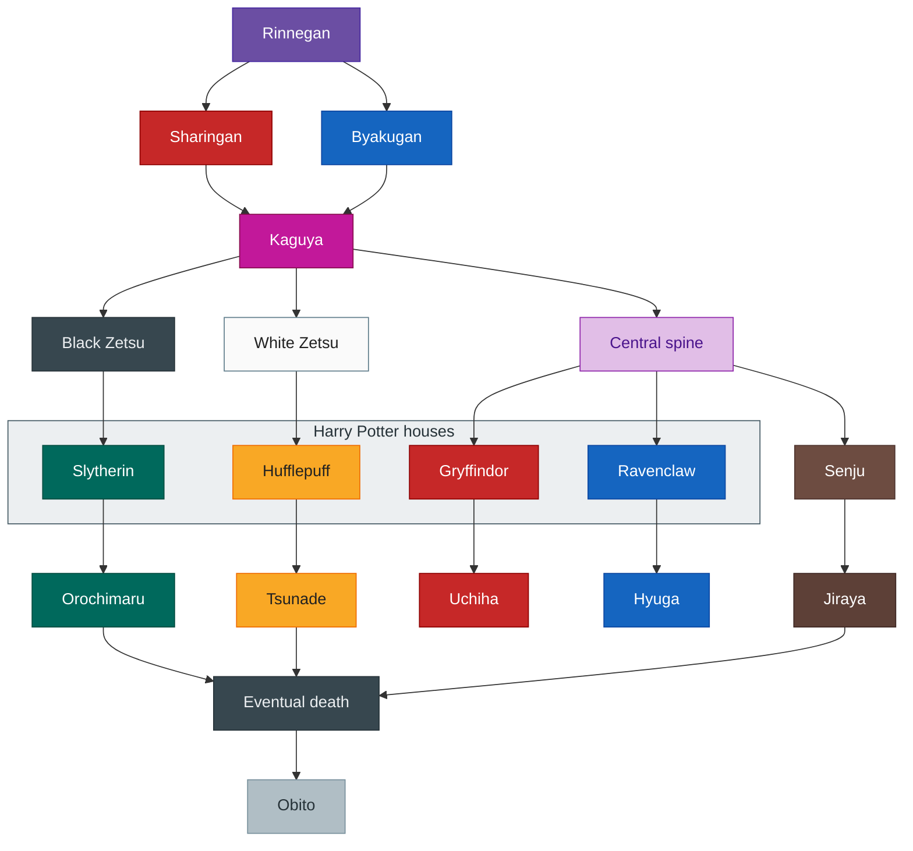

# Lineage descent (conceptual graph)

A **conceptual descent graph**: branches split and merge like lineage or inheritance across groups. It is **not** formal mathematical group theory. The diagram below uses pop-culture labels (Naruto-style dōjutsu line and Harry Potter houses) as **compact handles** for “who split from whom”—swap the labels in your head for families, clans, or subcultures if you prefer.

## IV, IQ, and what you train

**Pokémon IVs** are a useful metaphor for **what is mostly rolled at spawn**: baseline stats you **cannot respec** easily even when guides, coaches, and self-help imply you can grind anything flat. **IQ** is one readable stand-in in the real world for a **cognitive baseline**—contested, imperfect, but captures the idea of **different starting curves** for abstract reasoning.

**EVs** (effort values) and **EQ** (emotional and social skill built through repetition and feedback) are what you **actually train**: hours, relationships, habits, recovery from failure. The graph is about **lineage and branching identities**; the **main quest and judgment loop** live in [life-flow-judgment.md](life-flow-judgment.md). **How the whole thing feels like nested game instances** (blue/red pill, daily respawn) is in [life-game-structure.md](life-game-structure.md).

## Sharingan as Ditto, other lines as typed Pokémon

On this chart, treat **Sharingan** (and the Uchiha line it tags) as closer to **Ditto**: a bloodline built around **seeing and imitating**—in principle a **near-perfect copy** of another “species” once conditions are met. **Other kekkei genkai** (e.g. **Byakugan**, fixed house flavors in the HP band) read more like **other Pokémon**: **hard-coded** identity—strong in their lane, **less** about becoming someone else’s build wholesale.

That is **metaphor**, not canon accuracy: it names **flexible mimicry** vs **specialized, stable typing**.

## Items, juice, and cars

**Held items / vitamins** in Pokémon: **any** mon can get a **buff** from gear or training, but a **stronger baseline** often **scales harder** with the same item—percentages and ceilings favor what was already privileged.

**Cars:** you can tune a **Monza** until it is **surprisingly efficient**, but it will **rarely outrun** a **Mustang** on the same kind of story. If you can improve one, you can improve the other; the point is **which orange had less juice to begin with** and how much you are squeezing for **marginal** gains vs **natural headroom**. Same for people: **grind** lifts almost everyone; it does not **flatten** every starting gap.

## Talent, effort, and volatile inner life

**Effort alone** is **worth a lot**—EVs exist because training matters. **Talent × effort** tends to **compound**: when someone **high-ceiling** also **puts in hours**, outcomes often **cluster higher** than effort-only or talent-only stories suggest. Unfair, observable in the wild, still not a reason to zero out your own training.

**Inner personality and values** (what you actually choose under pressure) are **more volatile** for **Ditto-shaped** lines: if your gift is **becoming** or **mirroring**, identity and allegiance can **swing** more than for someone whose “type” was **legible from birth** and reinforced by every institution around them. Copiers pay a different tax: **flexibility** and **instability** trade off.

**See also:** [Life flow and final judgment](life-flow-judgment.md) · [Life game structure](life-game-structure.md)

Mermaid uses `classDef` fills; fixed hex colors can look strong in some dark-theme UIs—`color` on text is set for contrast.

