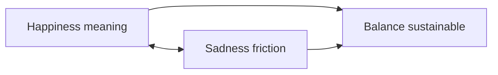
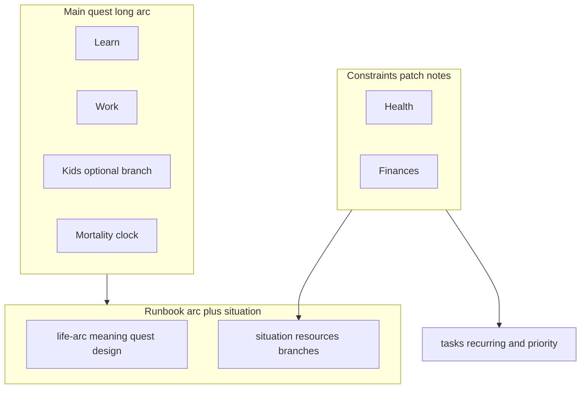

# Life arc — HUD runbook

**What this is:** a **video-game metaphor** for the same life you track elsewhere. **This file** is the **design doc**: main quest, win conditions, and how “the HUD” relates to numbers and routines. **[situation.md](situation.md)** is the **tactical layer**—current stats, runway, and branching paths (work, geography, money—filled by you when reality shifts).

**Related:** [Metaphors (comparison hub)](metaphors.md) · [Opposite comparisons (spectra)](opposite-comparisons.md) · [Life game structure (nested instance, daily loop)](life-game-structure.md) · [Life flow and judgment (birth–death loop)](life-flow-judgment.md) · [Lineage descent (endowment / lineage graph)](lineage-descent.md) · [Governance — ordered priorities](../tasks/governance.md) · [Routine mirror](../tasks/recurring.md) · [Priority execution](../tasks/priority.md) · [Task surfaces](../tasks/README.md) · [Notes root README](../README.md)

---

## Why compare life to a game

Games make **state** visible: health, mana, map position, active quests, optional objectives. Real life hides most of that—you have to **build your own HUD** or you steer blind. This **life HUD** is that overlay: not the whole truth, but a **readable** slice.

Deeper **engine** metaphor (instances, rings, pills, respawn loop) lives in [life-game-structure.md](life-game-structure.md). [metaphors.md](metaphors.md) routes short comparisons (GTA-shaped main vs side, **not LEGO**) without duplicating those long sections.

---

## Main quest (roughly universal, loosely ordered)

Think of a **main storyline** that many adults traverse—not always in a straight line:

1. **Learn** — skills, judgment, emotional literacy.
2. **Work** — trade time and skill for resources and structure.
3. **Raise kids** *(if you choose / life sends that arc)* — long, expensive, high-responsibility branch.
4. **Die** — the **hard** end state; everything else is side content against a finite clock.

The main quest is **broadly** shared; **how** you run it (pace, ethics, geography) is your build.

### When the “main quest” reroutes

**Accidents, disability, or lasting incapacity** can change what is **feasible** or **central**—for some people the coarse script above is a **poor fit**, not because they failed, but because the map changed. For **many** others the coarse arc is similar and **discretionary side quests** (especially in **free time**) are the **largest differentiator** between builds. See [metaphors.md](metaphors.md).

---

## Win condition: happiness with balance

- The “best ending” is **not** constant euphoria—it’s **sustainable** satisfaction.
- **Balance implies contrast:** some **sadness**, friction, or loss is part of a life that still feels **real** and **good** overall—not a bug.
- Chasing only highs usually **breaks** the build (burnout, numbness, bad trades).

---

## Timing beats perfect planning

Doing the **right thing in the right moment** often **feels better** than the same action executed in the **most optimized** plan on paper. Games reward **responsive** play, not only spreadsheet prep—same idea: keep **intent**, stay **flexible** on sequencing.

**HUD tie-in:** branches in [situation.md](situation.md) (e.g. job change, move) are **re-specs**, not failures of the old route.

---

## Not LEGO: irreversibility and friction

Life is **not** LEGO-like: blocks do not snap apart and rebuild for free. **Bureaucracy**, **physical recovery**, and **effort** sit between you and “undo.” Some outcomes are **non-recoverable**—you adapt or branch; you do not always get a clean restore point. [metaphors.md](metaphors.md) expands this contrast.

---

## Physical life, youth, memory

**Lens (on record):**

- **Sex and intimacy** are core human drives; **frequency and ease** often **drop** with age. The tradeoff you name: **prioritize honest enjoyment while young** enough that health and context allow it—without pretending there is no cost or risk.
- **Old age looks backward.** If youth was **empty** or **too far** from what you respect, memory becomes **regret** or **alienation** (“too different” from your own past self). If you can be **proud** of choices and courage, recall is easier to live inside.
- That pride/regret loop **feeds side systems**: **exercise**, **appearance**, **risk awareness**—not vanity alone, but **alignment** between how you live and who you want to **remember having been**.

---

## Fix before vengeance

Bias toward **repair, remedy, and bounded accountability** before making **retaliation** the main program. Harm can be real and still leave you better served by **fix-first** moves when they exist; the middle space is **justice**, not either pole alone—see [opposite-comparisons.md](opposite-comparisons.md).

---

## Side quests and the “best routine”

- **Main quest** is slow and coarse-grained.
- **Best routine** is **versatile**: it must **adapt** to **health** (energy, injury, mental state) and **finances** (runway, shocks). Same as respeccing a character when patch notes (life) change—except patches are **slow and costly** (see **Not LEGO** above).
- **Deep goal:** everyone needs a **north star** questline—something that makes **motivation** renewable when grind sets in. Without it, the HUD feels like **empty UI** (numbers with no “why”).

Execution detail: [../tasks/recurring.md](../tasks/recurring.md), [../tasks/priority.md](../tasks/priority.md).

---

## How the files split

| Piece | Role |
| --- | --- |
| **life-arc.md** | Metaphor, values, main vs side quest, balance—**slow to edit**. |
| **situation.md** | Current state, runway, next paths—**update when money or work changes**. |

---

## One-line maintenance rule

When **health**, **money**, or **relationship context** shifts enough that your **feelings** about the main quest change, touch **[situation.md](situation.md) first**; touch **life-arc.md** only when your **values or long arc** actually moved.
