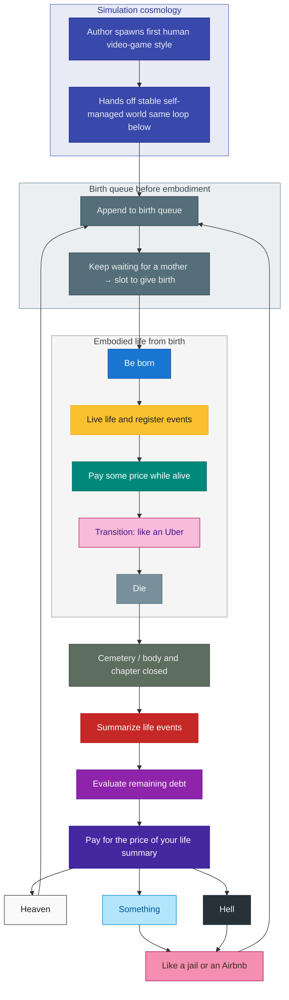

# Life flow and final judgment

## Scope and uncertainty (read first)

This file is **one bundle of hypotheses** about **why someone might be born with a given “build”** (only in the sense of a **fictional cosmology**: queue, operator, design) and **what might happen afterward**—birth, embodied life, death, then **possible** accounting and return to a queue. It is **not** a claim about physics, religion, or how the real world works.

- **No guarantee.** Reality might be **utterly indifferent**: random birth into an ordinary family, **no ledger**, **no judgment**, **no continuation**—only biology and chance, then **nothing** in any narrative sense. Treat every node after “die” as **optional fiction**, not something you should expect.
- **If** anything like a post-death layer existed, **lots of complexities** could apply (rules nobody stated, conflicting traditions, unknown branches). This diagram is **one** stylized map, not an exhaustive or true catalog.

For **talent, IQ/IV-style baselines, training, family lineages, and how embodied life is often structured** (school, career, routine), see [lineage-descent.md](lineage-descent.md)—that is a different question from “is there a loop after death?”

---

A **personal lifecycle model** (**optional metaphor**): an author spawns the first human like a video game, then the world runs hands-off and the same loop is a **stable, self-managed** birth–death–judgment cycle *in this story*. Layers in the diagram: **birth queue** (append and wait until a mother can give birth); **embodied life** (from birth through death); **after death** (cemetery, then accounting and judgment, then back to the queue). **Harm and penalty time (human-involved)** is described in a separate runbook (not in this repo) as a table sorted by typical duration of cost, not here. Everyday analogies (“like an Uber,” “like jail or an Airbnb”) are explicit nodes on purpose.

Mermaid uses `classDef` fills for readability; some renderers ignore subgraph styling.

**See also:** [Life game structure (nested instance, pills, daily loop)](life-game-structure.md) · [Lineage descent (talent, endowment, embodied social structure)](lineage-descent.md) · [Task governance (ordered priorities)](task-governance.md)

## Main loop and judgment branch

## Reading the model

Everything below assumes you are **inside the metaphor** for discussion. **Outside** the metaphor, none of this may hold.

### Ledger, fairness, and irreversibility

**If** the model were true: someone is always watching (VAR-style); unpaid costs while alive are settled after death. **Anti-hereditary:** no inheriting a dead person’s “slot”; sadness does not restore stolen happiness. **Why not delete the harm data:** without costs for harm, the “life game” loses purpose and fairness. **Irreversibility:** consequences rarely fully undo; no time-travel feature—broken bones do not always snap back.

### Free will, balance, and purpose

**If** the model were true: if everyone were controlled, the game is pointless; choices matter; rules exist for those currently in play. Desire to improve keeps the wheel turning; automation and balance read as ongoing forces.

### Simulation and spawner (metaphor)

**In this story only:** existence reads as a long-running process—a one-time “first character,” then autonomous queue and judgment without micromanagement—**useful metaphor, not a physics claim**.

### Operator, watching, and unequal spawn

**Security** here means *what it is reasonable to treat as stable or exogenous*: not password hygiene, but the boundary between a mostly hands-off runtime and rare, high-leverage intervention.

**“Everything is possible” vs. “anything can happen now.”** The video-game framing allows wild outcomes in principle, but it is a poor security model to expect miracles or catastrophes *with no antecedent*. A plausible companion picture is a **game operator** (or layer above the queue) that **mostly does not touch the simulation** and only acts when something in the design **strictly requires** it.

**Watching vs. intervening.** Continuous accounting is not the same as constant meddling. The ledger can run tight while the **joystick** moves only in rare, high-leverage moments.

**Forced events and disease as levers.** In that picture, the operator could **introduce or steer** things like illness and constraint—not as constant puppetry, but as **occasional** pressure when the system needs differentiation, stakes, or correction. **Metaphor unless you treat it as a claim.**

**Unequal spawn (in-model).** The queue picture needs different “characters” with different constraints. **Why** real people differ at birth (genes, environment, talent curves) is **not** settled here—see [lineage-descent.md](lineage-descent.md) for **IV/IQ-style baseline vs. trained stats** and family context. This file only needs the premise that **spawns are not equal** for the story to have stakes.

### Asymmetry, culture, and the discipline stack

**Roles feed on asymmetry.** Without people who are unwell, medicine has little to do; without the unknown, research loses its fuel. That is structural, not a moral endorsement.

**Cross-cultural parallel:** One culture may speak in **God and devil**; another in **judge, police, and jail** after a human complaint. The vocabularies differ, but many **rules underneath are shared**—people still coordinate on harm, consent, and enforcement. **Beliefs** shape different **blind spots and strengths**; the flowchart’s heaven / hell / “something” / jail-like nodes are one way to **map outcomes**, not a claim that one religion owns the truth.

**Mathematics** is the strongest shared baseline; **physics** and **chemistry** come next. Most of the rest of culture is **recombining** existing elements, packaging, and **selling** narratives or goods—powerful, but more contingent than the lower layers.

### Social limits and your minimap

**Proof, persuasion, and where logic stops.** In social life it is nearly impossible to **prove** much against a dedicated adversary: people lie, and rhetoric can build traps you cannot fully armor against with argument alone. **Violence** (or its threat) often appears when reasonable moves are exhausted—the ceiling on “purely logical” security.

**External memory and consistency.** What you already decided and wrote down is part of your security against self-contradiction: notes offload detail so working memory can track new situations.

**The mental bubble / partial minimap.** Each person starts like a **blank drive** loaded through family, place, and experience—a minimap of what they have actually seen. The full world map is unfinishable. Expect **large unknowns** outside your patch.

## Embodied chapter vs this file

**School, jobs, default “main quest,” routine, and lottery-style goals** are about **how life is structured once you are already here**—talent, effort, and social scripts. That lives in [lineage-descent.md](lineage-descent.md) so this note stays on **possible** birth-to-judgment **loops** and **after-death branches** only.

For **how daily play, instances, and pills layer as metaphor**, see [life-game-structure.md](life-game-structure.md).
