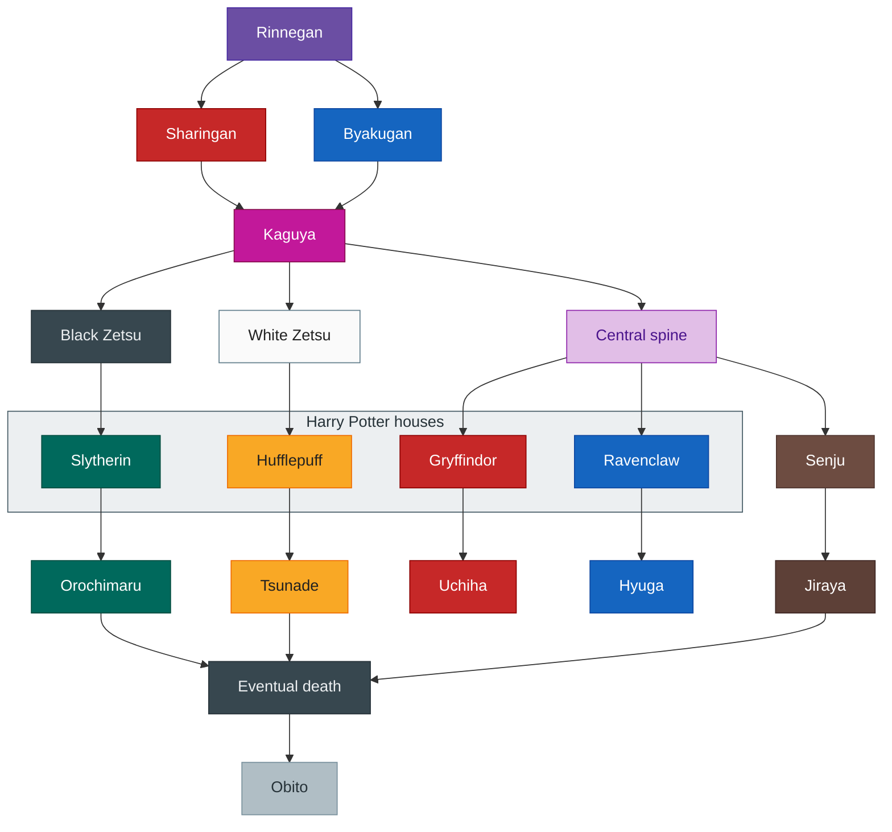

# Lineage descent (conceptual graph)

## Scope (this file)

This note is about **talent and starting conditions**: why people can differ at birth (genes, family, place, culture) and how **baseline vs training** interact **while alive**. It uses metaphors (Pokémon IV/EV, fiction lineages) as **handles**, not as science or fate.

- **In scope:** endowment, family/clan context at “spawn,” effort and experience, identity shaped by environment, **how embodied life is often structured** (school, work, social ladders).
- **Out of scope:** what—if anything—happens **after death**, queues, judgment, or cosmic “meaning” of your roll. For **optional lifecycle / post-death models** (all hypothetical), see [life-flow-judgment.md](life-flow-judgment.md).

**No guarantee.** You might have landed in a family or map **by sheer chance**, with **no special lineage story** and **nothing cosmic** tied to your stats. High or low talent does **not** promise any outcome; plenty of paths are **boring, unfair, or empty** in the sense of no larger arc. This file does **not** claim otherwise.

---

A **conceptual descent graph**: branches split and merge like lineage or inheritance across groups. It is **not** formal mathematical group theory. The diagram below uses pop-culture labels (Naruto-style dōjutsu line and Harry Potter houses) as **compact handles** for “who split from whom”—swap the labels in your head for families, clans, or subcultures if you prefer.

## Pokémon as comparison ladder (IV, IQ, EV, life, EQ)

Think of a person like a mon with **two layers**: what the RNG handed you, and what battles actually wrote into the sheet.

| Pokémon idea | Human-side handle | What it is trying to name |
| --- | --- | --- |
| **IVs** (individual values) | **IQ** (imperfect proxy) | Mostly **rolled at spawn**: baseline curves for speed of learning, memory, abstract pattern speed. You can still **play the game**; you cannot **fairly pretend** everyone started from the same hidden numbers. |
| **EVs** (effort values) | **Life experience** (hours, reps, scars) | What **battles and training** actually added: exposure, craft, domain mileage. Not vibes—**accumulated reps** that change what you can do without thinking. |
| **Social / emotional branch of that training** | **EQ** | Same EV layer, but the **relationship and regulation** skills: reading a room, apologizing well, not torching trust when stressed—built through **feedback loops**, not lecture. |

So: **IV ≈ “how high the ceiling tends to tilt at the start”** (IQ is one readable dial on that). **EV + EQ ≈ “what you actually installed by living.”** Self-help that promises you can **grind any IV flat** is selling a fantasy; **EV work is still real** and changes outcomes for almost everyone.

The graph below is about **lineage and branching identities**. **Judgment / after-death loops** (if any) are **not** claimed here—see [life-flow-judgment.md](life-flow-judgment.md). **Nested instances, pills, daily loop** in [life-game-structure.md](life-game-structure.md).

## Ditto, Sharingan, and copy-first identity

**Same mechanism, two worlds:** **Ditto** transforms by **absorbing a template** and temporarily **becoming** the other shape. **Sharingan** (in the story’s logic) **copies** what it **sees**—observe the pattern, replay it. Both are **see → imitate → run as if native**, not “invent from zero.”

**Ditto-shaped people** (flexible mimicry as the main gift) sit **somewhat** near folk images of **multiple personalities** or **strongly multiplex selves**: not a clinical claim about real disorders, but the **felt** idea that **which face is forward** can **switch** when the winning move is **become the other person’s build** for a while. **Fixed-type** people (Byakugan / house-flavor lines on the chart) may have **less** “who am I today?” volatility and **more** “I am always this typing.”

**Other kekkei genkai** and fixed HP-band flavors read more like **specialized Pokémon typings**: **hard-coded** strengths, **less** about wholesale **becoming** someone else’s sheet.

Metaphor only: names **flexible mimicry** vs **stable, legible typing**.

## Buffs anyone can hold (coffee, items) and long-run recoil

In Pokémon, **held items and consumables** can **buff anyone**: X Speed, vitamins, a berry—**you do not need** a privileged IV to **pop a temporary modifier**. Real life has the same shape: **coffee**, stimulants, all-nighters, prestige, anger—**short-term +2 to something you need right now**.

Two notes, same as good game design:

1. **Scaling is not flat**—a **universal** buff still tends to **do more on paper** for mons (and people) with **more headroom**: higher baseline × same percentage, same item, unequal delta (the classic IV × item interaction).

2. **Recoil over many turns**—buffs that **anyone** can use often **deal damage on a delay**: caffeine and debt sleep **tax** recovery; chronic stress **taxes** health; borrowed identity **taxes** coherence. You can **improve today** with a buff and still **pay interest** later if it replaces **sleep, food, or boundaries** instead of **stacking with** them.

## Juice and cars (marginal gains vs headroom)

**Cars:** you can tune a **Monza** until it is **surprisingly efficient**, but it will **rarely outrun** a **Mustang** on the same kind of story. If you can improve one, you can improve the other; the point is **which orange had less juice to begin with** and how much you are squeezing for **marginal** gains vs **natural headroom**. Same for people: **grind** lifts almost everyone; it does not **flatten** every starting gap.

## Talent, effort, and volatile inner life

**Effort alone** is **worth a lot**—EVs exist because training matters. **Talent × effort** tends to **compound**: when someone **high-ceiling** also **puts in hours**, outcomes often **cluster higher** than effort-only or talent-only stories suggest. Unfair, observable in the wild, still not a reason to zero out your own training.

**Inner personality and values** (what you actually choose under pressure) are **more volatile** for **Ditto-shaped** lines: if your gift is **becoming** or **mirroring**, identity and allegiance can **swing** more than for someone whose “type” was **legible from birth** and reinforced by every institution around them. Copiers pay a different tax: **flexibility** and **instability** trade off.

## Life structure once born (main quest, routine, realism)

Culture and media often script a **default main quest**: compete for grades at school and university, then for jobs, then for a “successful” child to raise, then some rest when old. That path is **linear and competitive**; it forgives **few** mistakes—a skipped year or a serious health hit can **reshape** the rest of the story. **The Sims** is a useful parallel for **staged social progression** (needs, career ladder, household), not for stat breeding—that sits in the IV/EV framing above.

What often separates people from what they want is **routine** plus **realism**: naming an **achievement list** (what “done” looks like) and executing toward it daily. **Lottery** goals work the same way: you only win if you play, and long shots need a **sustainable** routine so you can keep “buying tickets” for a lifetime without burning out.

**Practical execution** (surfaces, pick-one-task, P0–P4) — [`../tasks/priority.md`](../tasks/priority.md) and [`../tasks/README.md`](../tasks/README.md); **principles** (ordered stack, emotional routing) — [`../tasks/governance.md`](../tasks/governance.md).

**See also:** [Life flow and final judgment](life-flow-judgment.md) (hypothetical post-death framing only) · [Life game structure](life-game-structure.md) · [Life arc (HUD runbook)](life-arc.md) · [Metaphors (comparison hub)](metaphors.md)

Mermaid uses `classDef` fills; fixed hex colors can look strong in some dark-theme UIs—`color` on text is set for contrast.

The **“Eventual death”** node in the diagram is a **story beat** in the metaphor, not a claim about what comes next.

