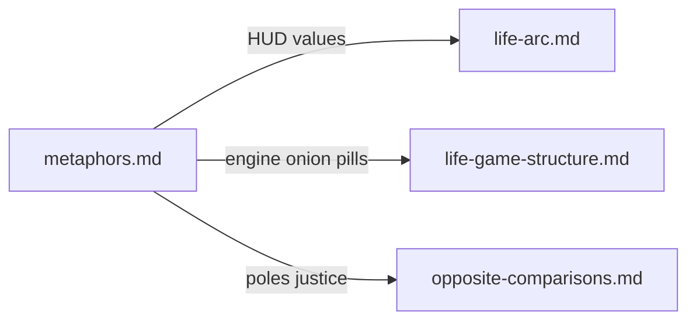

# Metaphors — comparison hub

**What this is:** short **handles** for talking about life (games, toys, HUD). Each section points to where the idea is **expanded** so this file stays a **map**, not a second copy of the long structural notes.

**See also:** [Life arc (HUD runbook)](life-arc.md) · [Life game structure (nested instance, machinery)](life-game-structure.md) · [Opposite comparisons (spectra)](opposite-comparisons.md) · [Situation (tactical layer)](situation.md) · [Governance — principles](../tasks/governance.md)

---

## Open world, coarse main quest (GTA-shaped)

Many adults share a **broad storyline**: learn, work, optional raising of dependents, finite clock. In that sense life can read like an **open-world game with a loose “main quest”**—not a single script everyone runs identically, but a **coarse spine**.

- **Where the engine detail lives** (nested instances, rings, daily loop, pills framing): [life-game-structure.md](life-game-structure.md).
- **Where the player-facing HUD and values live**: [life-arc.md](life-arc.md).

For **many** typical trajectories, **what you do in discretionary time** (side quests) is the **largest differentiator**. **Exceptions matter:** accident, disability, or lasting incapacity can **rewrite** what “main quest” means—do not erase that with a one-size hero path. [life-arc.md](life-arc.md) states that branch plainly.

---

## Not LEGO: limited snap-fixes

LEGO-like play assumes **blocks come apart and recombine fast**, with **low permanent cost**.

Real life has:

- **Friction** — forms, institutions, waiting, negotiation (**bureaucracy** in the neutral sense).
- **Physical cost** — healing, repair, relocation, rebuilding take **time and effort**.
- **Non-recovery** — some breaks do not fully snap back; some states are **absorbing** (you adapt rather than “restore save”).

Use this contrast when **respec** metaphors tempt you to treat every mistake as instantly reversible. [life-arc.md](life-arc.md) ties the same idea to HUD maintenance and [situation.md](situation.md) to **current** branches you can actually change.

---

## HUD overlay

You do not get a shipped UI for health, money, map position, or active quests. A **HUD** is the **readable slice** you build on purpose—numbers and narrative live partly in [situation.md](situation.md); **meaning and quest design** in [life-arc.md](life-arc.md).

---

## Direct flow (lightweight)

How the short metaphors **route** to longer docs:

