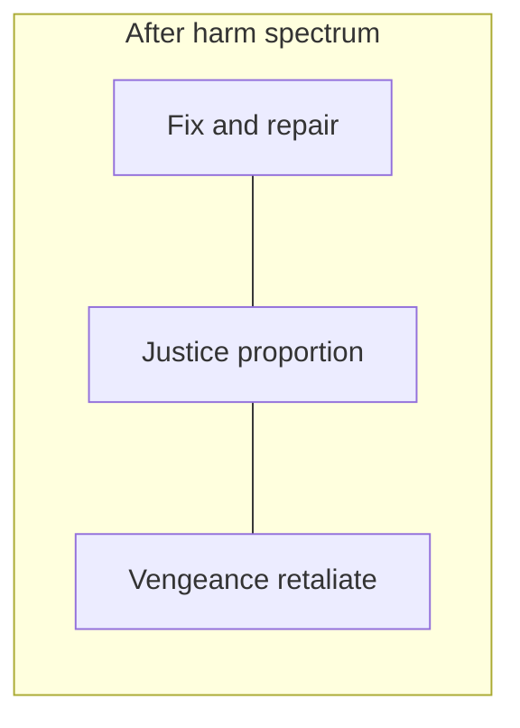

# Opposite comparisons — poles and middle spaces

**What this is:** paired **tensions** named as opposites, with an explicit **middle** or **third** zone—useful for steering without pretending life is one boolean. Metaphor and vocabulary, not a claim that everyone “should” land in the center on every axis.

**See also:** [Life arc (HUD runbook)](life-arc.md) · [Metaphors (comparison hub)](metaphors.md) · [Governance — principles](../tasks/governance.md)

---

## Pattern

For each line: **two poles** and a **middle** that is not “zero” but **another quality**—often slower, more contextual, or more accountable than either pole alone.

---

## Happy and sad

- **Poles:** euphoria-chasing ↔ numb collapse.
- **Middle:** **sustainable satisfaction** — room for real sadness and friction without treating contrast as failure. Echoes the balance idea in [life-arc.md](life-arc.md).

---

## Fear and courage

- **Poles:** panic / freeze ↔ reckless bravado.
- **Middle:** **calm agency** — act with information, pacing, and proportion; courage without contempt for risk.

---

## Rich and poor (resource framing)

- **Poles:** shame about means ↔ flex / contempt for constraint.
- **Middle:** **clear-eyed optionality** — honest about runway and tradeoffs without tying dignity to a single scoreboard. Tactical numbers belong in [situation.md](situation.md).

---

## Fix and vengeance

- **Poles:** **Fix** — repair what can be repaired, compensate where possible, change systems that failed. **Vengeance** — hurt back as the main dish; escalation as identity.
- **Middle:** **justice** — proportion, accountability, truth where it matters, consequences that **reduce future harm** more than they **feed the loop**. Often overlaps with **fix-first** instincts but can include **hard boundaries** where repair is refused.

**Norm (actionable):** **look for fixes and remedies before vengeance** — not because harm “does not count,” but because retaliation-only strategies often **expand** damage without restoring what was lost. When fix is impossible or unsafe, the middle still rejects **pure** vengeance-as-entertainment; it asks what **stops the next wound**.

---

## Sketch: fix — justice — vengeance

Read as **positions on a line**, not a story where one pole must become the other. **Justice** names the **middle space** between remedy-only denial and retaliation-only loops.
