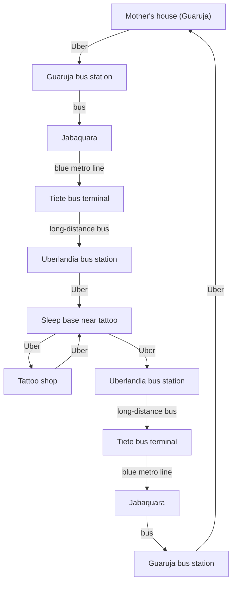

# Tattoo trip runbook — Guarujá to Uberlândia

Trip playbook for buses, hotel, tattoo, and downtime. **Long São Paulo–Uberlândia legs** use **individual seat (ida e volta)** when available. Keep **dates and ticket rows out of this file**—use a calendar or operator app for the live schedule; use this doc for **rules, order of operations, and price structure**. Shared purchase timing, metro vs Uber, and hub rules: [`README.md`](README.md).

## Index

- [Tattoo trip runbook — Guarujá to Uberlândia](#tattoo-trip-runbook--guarujá-to-uberlândia)
  - [Index](#index)
  - [Trip endpoints (confirm each trip)](#trip-endpoints-confirm-each-trip)
  - [Path defaults (this corridor)](#path-defaults-this-corridor)
  - [Path diagram](#path-diagram)
  - [Outbound itinerary (anchor day)](#outbound-itinerary-anchor-day)
  - [Long haul into Uberlândia](#long-haul-into-uberlândia)
  - [Return itinerary](#return-itinerary)
  - [Purchase runbook](#purchase-runbook)
  - [Timing worksheet](#timing-worksheet)
  - [Hotel decision rule](#hotel-decision-rule)
  - [Checklist](#checklist)
  - [Return same day as arrival](#return-same-day-as-arrival)
  - [Costs reference (evaluation skeleton)](#costs-reference-evaluation-skeleton)
  - [Related](#related)

## Trip endpoints (confirm each trip)

- **Home (only here):** **mother’s house in Guarujá** — the trip **starts** here and must **end** here after the loop. Plan the **last mile** from Guarujá rodoviária (or equivalent drop-off) **back to this same house**.
- **Middle of the trip (anchor):** the **tattoo shop** (inland). Local legs that day are **sleep base near the shop ↔ tattoo shop** — hotel, host, or other **stay** you booked for that night; do **not** call that “mother’s house.”
- **Flow:** leave **mother’s house (Guarujá)** → long legs to the inland area → **tattoo appointment** as the fixed commitment → long legs back → **mother’s house (Guarujá)** again.

Confirm pickup, drop-off, and pins in maps or calendar notes; this file only names the roles.

## Path defaults (this corridor)

- **Tietê–Uberlândia** often still has **single-seat / individual** inventory if you buy with **some lead time** — default here is **long-distance bus + individual seat**, not flight, unless dates or health constraints force a change.
- **Under ~10 hours in-seat** on a night bus is usually tolerable; treat **flight + airport overhead** as optional unless total door-to-door pain is **very long** (same **~12h** thumb rule as in [`README.md` — Common heuristics](README.md#common-heuristics)). This route stays in **night-bus territory**.
- **Jabaquara ↔ Tietê:** default **metro Line 1-Azul**; if the metro is closed or impractical, **Uber on that segment is possible but costly** — see [`README.md` — Metro vs ride-hail](README.md#metro-vs-ride-hail-connectors).

## Path diagram

Read **top to bottom**: leave **mother’s house (Guarujá)** only as home, long haul in, **anchor at the tattoo shop** with a **local sleep base** (not home), then return toward the coast and **the same house in Guarujá**. **Uberlandia bus station** appears twice (`ub1` / `ub2`) for layout; it is the same place.



If the diagram does not render, use this **ASCII sketch** (same steps, English labels):

```text
Start:    Mother's (Guaruja) →Uber→ Guaruja bus station
Inbound:  Guaruja bus station →bus→ Jabaquara →blue metro line→ Tiete bus terminal
          →long-distance bus→ Uberlandia bus station (ub1) →Uber→ Sleep base near tattoo
Anchor:   Sleep base →Uber→ Tattoo shop →Uber→ Sleep base
Return:   Sleep base →Uber→ Uberlandia bus station (ub2) →long-distance bus→ Tiete bus terminal
          →blue metro line→ Jabaquara →bus→ Guaruja bus station
End:      Guaruja bus station →Uber→ Mother's (Guaruja)
```

## Outbound itinerary (anchor day)

**From:** **sleep base** (hotel or host **near the tattoo shop**) — **To:** tattoo shop — **Mode:** Uber **direct** (no walk segment unless the driver cannot reach the door; confirm pins for both ends).

After the appointment, return to the **same sleep base** before other same-day legs (for example rodoviária) unless the schedule forces a different order. **Mother’s house** is only in **Guarujá** (start and end of the whole trip).

## Long haul into Uberlândia

Use when you are coming **from Guarujá (mother’s house)** into Uberlândia before the anchor (order still follows [Purchase runbook](#purchase-runbook)):

1. Uber **from mother’s house (Guarujá)** to Guarujá rodoviária.
2. Bus to Jabaquara.
3. Metro blue line to Tietê (or costly Uber substitute — [README](README.md#metro-vs-ride-hail-connectors)).
4. Long bus to Uberlândia (prefer **night** departure from Tietê when it matches anchor; **individual seat**).
5. Uber (or arranged ride) **from Uberlândia rodoviária** to your **sleep base** near the tattoo shop — still not mother’s house; home remains **Guarujá** until the return loop finishes.

## Return itinerary

1. Uber **from sleep base near the tattoo shop** to Uberlândia rodoviária (confirm time vs long-bus departure).
2. Long bus to Tietê (pick time to match anchor and recovery; **individual seat**).
3. Metro blue line to Jabaquara (or costly Uber substitute — [README](README.md#metro-vs-ride-hail-connectors)).
4. Bus to Guarujá rodoviária.
5. Uber **from Guarujá rodoviária to mother’s house (Guarujá)** — close the loop to the same origin.

**Jabaquara → Guarujá:** intermunicipal buses on this leg **do not run before about 06:00** (confirm with the operator when you buy). You **cannot** complete this connector earlier, so **do not plan** to be in Guarujá (or on that bus) before first service—there is **no need to arrive at Tietê / ride the metro** early enough to “catch” a pre-dawn Guarujá bus that does not exist. If the long bus from Uberlândia drops you at Tietê very early, use the buffer (coffee, wait in station) until the **Jabaquara → Guarujá** window opens.

## Purchase runbook

Order:

1. Confirm tattoo date/window (anchor).
2. **Lock long arrival + long return** (São Paulo ↔ Uberlândia) with **individual seats** when the seat map opens — **this corridor** usually cooperates if you are not buying last minute.
3. Reserve one hotel night aligned with the schedule (see hotel rule).
4. Buy short connectors nested around those long legs.
5. Confirm metro credit and Uber app balance.
6. Confirm card limit/expiry and backup payment method.

## Timing worksheet

1. Lock **Tietê → Uberlândia** departure once the **latest acceptable arrival** before the anchor is clear (work backward from the tattoo time with buffers from [`README.md`](README.md)).
2. Work backward for latest safe **Guarujá** departure to hit Tietê with buffer.
3. Keep **60–90 min** safety buffer at Tietê.
4. Prefer **4h30–5h** total cushion before long-bus departure from Tietê when coming from the coast.
5. On the **return** coast leg, remember **Jabaquara → Guarujá** starts around **06:00** at the earliest—do not compress the Tietê → Jabaquara → Guarujá chain to land in Guarujá before first bus; extra time at Tietê or Jabaquara is normal.

## Hotel decision rule

- **Flexible cancellation:** you can book before all bus legs are final.
- **Strict / non-refundable:** lock **long outside bus pair** first, then hotel.
- Align **one sleep night** with the real tattoo/travel window.

## Checklist

1. Confirm tattoo date and window.
2. **Book long outbound + long return** (individual seats on São Paulo–Uberlândia).
3. Reserve hotel with suitable cancellation risk.
4. Buy short connector legs second.
5. Confirm metro + Uber credits.
6. Keep tickets/seat info offline.

## Return same day as arrival

When **arrival** and **long return** fall on the **same calendar day** (common with night-in + night-out):

- [ ] Long return leg chosen (operator, time, seat **individual**).
- [ ] Daytime: tattoo, meals, rest, storage — realistic gap before terminal.
- [ ] Last-mile **from sleep base** (hotel/host pickup point) to Uberlândia rodoviária — not mother’s house; home is only **Guarujá**.
- [ ] Offline: return QR/PDF, seat, platform habits for that terminal.

## Costs reference (evaluation skeleton)

Use the table to **re-quote each trip**: replace amounts with current research; keep line items so totals stay comparable trip to trip.

| Expense                 |     Estimate |
| ----------------------- | -----------: |
| Food                    |       R$ 150 |
| Hotel                   |       R$ 200 |
| Long bus (outbound)     |       R$ 375 |
| Long bus (return)       |       R$ 375 |
| Short bus (coast leg 1) |        R$ 75 |
| Short bus (coast leg 2) |        R$ 75 |
| Tattoo                  |       R$ 600 |
| Uber (trip total)       |       R$ 135 |
| Metro SP                |        R$ 15 |
| **Total**               | **R$ 2,000** |

## Related

- Trips index: [`README.md`](README.md)
- Finance / tax runbooks are **not** in this repository; add links here only if you later keep them under `notes/`.
